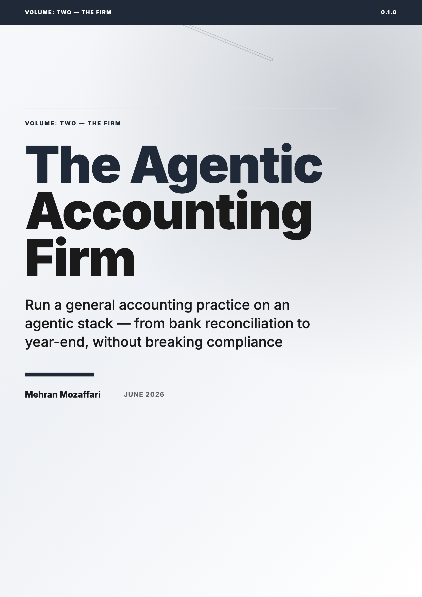

# The Agentic Accounting Firm

> Run a general accounting practice on an agentic stack — from bank reconciliation to year-end, without breaking compliance · by Mehran Mozaffari

Covers: the agentic firm operating model; the stack (Claude Code/OpenCode/Codex + Xero/XPM/ATO via MCP); the firm constitution files; the toolkit (skills/hooks/MCP/plugins/subagents) at firm scale; the operating lifecycle mapped to agents (bank rec, AR/AP, invoicing, expenses, payroll/STP, super, GST/BAS); the month-end and year-end close as multi-agent workflows; client lifecycle, onboarding, OCR document intake, offboarding; the workpaper and audit-trail spine (traceability); management reporting and cash flow; segregation of duties, human gates (H1/H2/H3), and professional liability/PI insurance; capacity planning, value pricing, and the 2027 firm. Does NOT give tax, financial product, or legal advice and does not replace the firm's registration or professional judgement.

## Read Online

Read the book in the browser on the dedicated website: [https://imehr.github.io/the-agentic-accounting-firm-site/](https://imehr.github.io/the-agentic-accounting-firm-site/). The web version is the best place to browse chapters and share the book; this repository holds the downloadable editions.

## Download

All formats are attached to the [v0.1.0 GitHub Release](https://github.com/imehr/the-agentic-accounting-firm/releases/tag/the-agentic-accounting-firm-v0.1.0) ([latest](https://github.com/imehr/the-agentic-accounting-firm/releases/latest)).

| Format | File |
|--------|------|
| Paged HTML Preview | [the-agentic-accounting-firm-paged.html](https://github.com/imehr/the-agentic-accounting-firm/releases/download/the-agentic-accounting-firm-v0.1.0/the-agentic-accounting-firm-paged.html) |
| ePub | [the-agentic-accounting-firm.epub](https://github.com/imehr/the-agentic-accounting-firm/releases/download/the-agentic-accounting-firm-v0.1.0/the-agentic-accounting-firm.epub) |
| HTML | [the-agentic-accounting-firm.html](https://github.com/imehr/the-agentic-accounting-firm/releases/download/the-agentic-accounting-firm-v0.1.0/the-agentic-accounting-firm.html) |
| PDF | [the-agentic-accounting-firm.pdf](https://github.com/imehr/the-agentic-accounting-firm/releases/download/the-agentic-accounting-firm-v0.1.0/the-agentic-accounting-firm.pdf) |

## What This Book Covers

Covers: the agentic firm operating model; the stack (Claude Code/OpenCode/Codex + Xero/XPM/ATO via MCP); the firm constitution files; the toolkit (skills/hooks/MCP/plugins/subagents) at firm scale; the operating lifecycle mapped to agents (bank rec, AR/AP, invoicing, expenses, payroll/STP, super, GST/BAS); the month-end and year-end close as multi-agent workflows; client lifecycle, onboarding, OCR document intake, offboarding; the workpaper and audit-trail spine (traceability); management reporting and cash flow; segregation of duties, human gates (H1/H2/H3), and professional liability/PI insurance; capacity planning, value pricing, and the 2027 firm. Does NOT give tax, financial product, or legal advice and does not replace the firm's registration or professional judgement.

15 chapters are included in this release.

## Who Is This For

Accounting firm principals, partners, practice managers, and senior operations staff who already use AI coding agents (Claude Code, Codex, OpenCode) and want a firm-level operating and governance model for an agent-augmented accounting practice. Assumes comfort with AI tooling; assumes basic-to-intermediate practice-management knowledge; does not assume software engineering background.

## Repository Contents

| Path | Purpose |
|------|---------|
| `README.md` | Public landing page for the book repository |
| `CHANGELOG.md` | Version-by-version release notes |
| `LICENSE.md` | Book license |
| `cover.png` | Public cover image generated from the same HTML cover used by the book artifacts |
| `<slug>.pdf` / `<slug>.epub` / `<slug>.html` / `<slug>-paged.html` | Final published book artifacts |

## About the Author

Mehran Mozaffari

## Credits

| Role | Credit |
|------|--------|
| Author | Mehran Mozaffari |
| Editorial review | Multi-model AI review pipeline |
| Technical reviewers | Claude Opus 4.6, Gemini 3.1 Pro |
| Design and production | Agentic publishing pipeline (OpenCode) |

## Contact the Author

- Blog: [https://piazr.github.io/applied-ai/](https://piazr.github.io/applied-ai/)
- GitHub: [https://github.com/imehr](https://github.com/imehr)

For corrections, errata, or licensing inquiries, please open an issue on this repository or contact the author through the channels above.

## Version

- **v0.1.0** — 2026-06-23
- AI tools evolve rapidly; check the official project documentation for current product behavior.

## License

[CC BY-NC-SA 4.0](https://creativecommons.org/licenses/by-nc-sa/4.0/) — free to share and adapt with attribution, non-commercial use only, under the same license.
